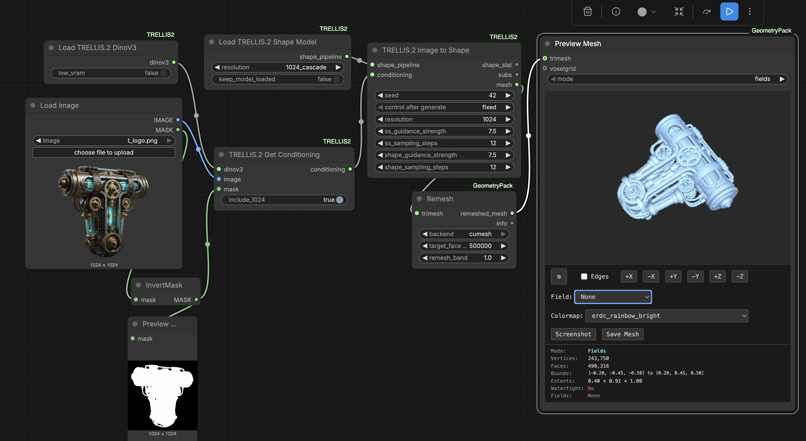
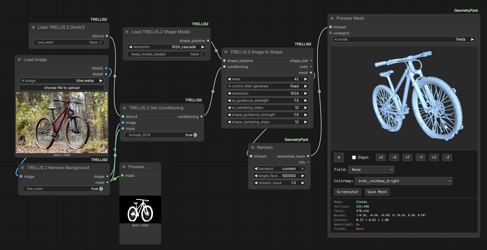

# ComfyUI-TRELLIS2

 
<b><a href="https://pozzettiandrea.github.io/ComfyUI-TRELLIS2/">View Live Test Gallery →</a></b>

ComfyUI custom nodes for [TRELLIS.2](https://github.com/microsoft/TRELLIS.2) - Microsoft's state-of-the-art image-to-3D generation model.

Generate high-quality 3D meshes with PBR (Physically Based Rendering) materials from a single image.

### Install via ComfyUI Manager (Recommended)

Search for "ComfyUI-TRELLIS2" in ComfyUI Manager and click install.

## Example Workfloww

https://github.com/user-attachments/assets/e28e4a74-b119-4303-8e30-63361f26aa88

## Community

Questions or feature requests? Open a [Discussion](https://github.com/PozzettiAndrea/ComfyUI-TRELLIS2/discussions) on GitHub.

Join the [Comfy3D Discord](https://discord.gg/bcdQCUjnHE) for help, updates, and chat about 3D workflows in ComfyUI.

## Credits

- [TRELLIS.2](https://github.com/microsoft/TRELLIS.2) by Microsoft Research

## Contributing

Contributions are welcome! Please feel free to submit issues and pull requests.