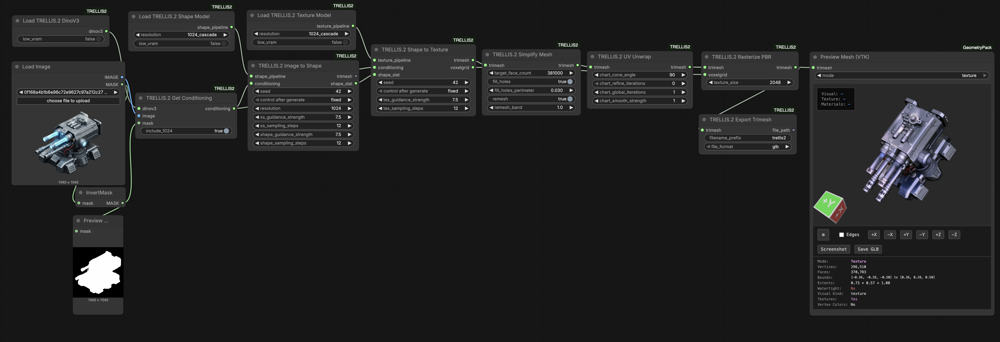

# ComfyUI-TRELLIS2

ComfyUI custom nodes for [TRELLIS.2](https://github.com/microsoft/TRELLIS.2) - Microsoft's state-of-the-art image-to-3D generation model.

Generate high-quality 3D meshes with PBR (Physically Based Rendering) materials from a single image.

### Install via ComfyUI Manager (Recommended)

Search for "ComfyUI-TRELLIS2" in ComfyUI Manager and click install.

## Example Workflow

1. Load Image
2. Load TRELLIS.2 Model
3. (Optional) Configure Sampler Parameters
4. Run Image to 3D
5. Export GLB or Render Preview

## Requirements

- Python 3.10+
- PyTorch 2.0+
- CUDA-compatible GPU with 8GB+ VRAM (16GB+ recommended)
- TRELLIS.2 and its dependencies

## License

MIT License - See LICENSE file for details.

## Credits

- [TRELLIS.2](https://github.com/microsoft/TRELLIS) by Microsoft Research
- Inspired by [ComfyUI-DepthAnythingV3](https://github.com/PozzettiAndrea/ComfyUI-DepthAnythingV3)

## Contributing

Contributions are welcome! Please feel free to submit issues and pull requests.
